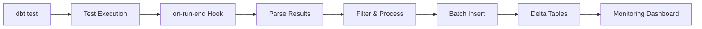

# dbt-test-results

<div align="center">

[](https://opensource.org/licenses/MIT)
[](https://github.com/dbt-labs/dbt-core)
[](https://databricks.com/)

**Automatically capture and store dbt test results for monitoring, alerting, and historical analysis**

[Quick Start](#-quick-start) • [Documentation](#-documentation) • [Examples](#-examples) • [Support](#-support)

</div>

## 🎯 Overview

dbt-test-results is a powerful package that automatically captures and stores your dbt test execution results in Delta tables. Simply add a configuration to your model schema files, and all test results will be stored with rich metadata for monitoring, alerting, and historical analysis.

### ✨ Key Features

- 🔄 **Automatic Test Storage**: Zero-code test result capture
- 📊 **Rich Metadata**: Execution times, failure counts, test types, and more
- 🚀 **High Performance**: Optimized batch processing and Delta Lake integration
- 🎛️ **Flexible Configuration**: Fine-grained control over what gets stored
- 📈 **Historical Analysis**: Track data quality trends over time
- 🔧 **Production Ready**: Enterprise-grade error handling and monitoring
- 🎨 **Multiple Scenarios**: Single tables, shared tables, filtered tests

## 🚀 Quick Start

### 1. Install the Package

Add to your `packages.yml`:
```yaml
packages:
  - git: "https://github.com/xoniks/dbt-test-results.git"
    revision: main
```

Run:
```bash
dbt deps
```

### 2. Configure Your Project

Add to your `dbt_project.yml`:
```yaml
vars:
  dbt_test_results:
    enabled: true
    absolute_schema: "test_results"  # All test results in one schema
    # OR use schema_suffix: "_test_results" to append to model schemas
    auto_create_tables: true
    debug_mode: true  # Enable for initial setup
    table_config:
      file_format: "delta"
```

**Note:** The package automatically adds the required on-run-end hook - no manual hook configuration needed!

### 3. Enable Test Storage

In your `models/schema.yml`:
```yaml
models:
  - name: my_model
    config:
      store_test_results: "my_model_test_log"  # 🔥 This enables storage!
    columns:
      - name: id
        tests:
          - unique
          - not_null
```

### 4. Run Tests

```bash
dbt test
```

That's it! Your test results are now automatically stored in `your_schema_test_results.my_model_test_log`.

**👉 [See full quickstart guide](examples/quickstart/README.md)**

## 📊 What You Get

After running tests, you'll have rich test result data:

```sql
SELECT * FROM your_schema_test_results.my_model_test_log;
```

| execution_id | execution_timestamp | model_name | test_name | test_type | status | failures |
|--------------|-------------------|------------|-----------|-----------|--------|----------|
| exec_20231201_143022_1234 | 2023-12-01 14:30:22 | my_model | unique_my_model_id | unique | pass | 0 |
| exec_20231201_143022_1234 | 2023-12-01 14:30:22 | my_model | not_null_my_model_id | not_null | pass | 0 |

**Perfect for**: Data quality monitoring, alerting, trend analysis, compliance reporting

## ⚙️ Configuration

### 🎯 Basic Configuration

```yaml
# dbt_project.yml
vars:
  dbt_test_results:
    enabled: true
    schema_suffix: "_test_results"
    auto_create_tables: true
    batch_size: 1000
```

### 🔧 Advanced Configuration

```yaml
vars:
  dbt_test_results:
    # Performance
    batch_size: 5000
    use_merge_strategy: true
    max_parallel_batches: 10
    
    # Filtering
    failed_tests_only: false
    include_models: ["dim_*", "fact_*"]
    exclude_models: ["staging_*"]
    include_test_types: ["unique", "not_null"]
    
    # Data retention
    retention_days: 365
    auto_cleanup: true
    
    # Metadata
    include_timing: true
    include_test_config: true
    custom_tags:
      environment: "prod"
      team: "data"
```

**👉 [See all configuration options](examples/configurations/)**

## 🎨 Usage Patterns

### Single Model → Single Table
```yaml
models:
  - name: customers
    config:
      store_test_results: "customers_test_log"
```

### Multiple Models → Shared Table
```yaml
models:
  - name: dim_customers
    config:
      store_test_results: "dimension_quality_checks"
  - name: dim_products  
    config:
      store_test_results: "dimension_quality_checks"  # Same table
```

### Environment-Specific Configuration
```yaml
# Development
vars:
  dbt_test_results:
    schema_suffix: "_dev_test_results"
    debug_mode: true
    batch_size: 100

# Production  
vars:
  dbt_test_results:
    absolute_schema: "data_quality_prod"
    failed_tests_only: false
    retention_days: 365
```

## 📋 Result Table Schema

| Column | Type | Description |
|--------|------|-------------|
| `execution_id` | STRING | Unique identifier for test execution batch |
| `execution_timestamp` | TIMESTAMP | When the test execution started |
| `model_name` | STRING | Name of the model being tested |
| `test_name` | STRING | Name of the specific test |
| `test_type` | STRING | Type of test (unique, not_null, custom, etc.) |
| `column_name` | STRING | Column being tested (if applicable) |
| `status` | STRING | Test result (pass, fail, error, skip) |
| `execution_time_seconds` | DOUBLE | Time taken to execute the test |
| `failures` | BIGINT | Number of failing records |
| `message` | STRING | Test failure message or details |
| `dbt_version` | STRING | Version of dbt used for execution |
| `test_unique_id` | STRING | Unique identifier of the test node |
| `compiled_code_checksum` | STRING | Checksum of compiled test SQL |
| `additional_metadata` | STRING | JSON with additional test metadata |

## 📚 Documentation

- 📖 **[Examples](examples/)** - Quickstart and advanced usage patterns
- 🔧 **[Configuration](examples/configurations/)** - Environment-specific settings  
- 🧪 **[Integration Tests](integration_tests/)** - Comprehensive test suite
- 📊 **[Best Practices](#-best-practices)** - Production deployment guidance
- 🐛 **[Troubleshooting](#-troubleshooting)** - Common issues and solutions

## 🏗️ Architecture



## 🎯 Use Cases

- **📊 Data Quality Monitoring**: Track test pass/fail rates over time
- **🚨 Alerting**: Get notified when critical tests fail
- **📈 Trend Analysis**: Identify data quality patterns and regressions  
- **🔍 Root Cause Analysis**: Drill down into test failures with rich metadata
- **📋 Compliance Reporting**: Generate data quality reports for audits
- **⚡ Performance Monitoring**: Track test execution times and optimize

## 🛠️ Requirements

- **dbt-core**: >= 1.0.0
- **Database**: Databricks/Spark (optimized for Delta tables)
- **Python**: >= 3.7
- **Permissions**: Create schemas and tables in target database

## 💡 Best Practices

### 🚀 Performance
- Adjust `batch_size` based on your cluster size (1000-5000 recommended)
- Use `use_merge_strategy: true` for high-concurrency environments
- Enable Delta optimizations: `delta.autoOptimize.optimizeWrite: true`
- Partition large result tables by date

### 🔒 Production Deployment
- Set `fail_on_error: true` to catch configuration issues early
- Use `absolute_schema` for centralized monitoring
- Configure retention policies: `retention_days: 365`
- Enable `auto_cleanup: true` for automated maintenance

### 📊 Monitoring Setup
- Filter by critical models: `include_models: ["dim_*", "fact_*"]`
- Focus on key test types: `include_test_types: ["unique", "not_null"]`
- Add custom tags for better organization
- Set up alerting on test result tables

### 🎯 Development Workflow
- Start with `debug_mode: true` for troubleshooting
- Use smaller `batch_size` in development
- Test with a subset of models first
- Validate configuration before production deployment

## 🐛 Troubleshooting

### Common Issues

#### ❌ No test results stored
```yaml
# Check these settings:
config:
  store_test_results: "table_name"  # ✅ Must be in schema.yml

vars:
  dbt_test_results:
    enabled: true                    # ✅ Must be enabled
    debug_mode: true                 # ✅ Enable for troubleshooting

# ✅ The package automatically adds the on-run-end hook
```

#### ❌ Permission errors
- Ensure database user can CREATE SCHEMA and CREATE TABLE
- Check target schema exists or enable `auto_create_schemas: true`
- Verify network connectivity to database

#### ❌ Performance issues
- Reduce `batch_size` if experiencing timeouts
- Increase cluster size for large test suites  
- Enable Delta optimizations for better query performance
- Consider filtering with `include_models` or `failed_tests_only`

#### ❌ Configuration errors
```bash
# Enable debug mode for detailed logging
vars:
  dbt_test_results:
    debug_mode: true
    logging:
      level: "debug"
```

### Getting Help

1. **Check logs**: Look for "dbt-test-results" messages in dbt output
2. **Enable debug mode**: Set `debug_mode: true` for verbose logging
3. **Validate configuration**: Run `dbt compile` to check for syntax errors
4. **Test incrementally**: Start with one model to isolate issues
5. **Review examples**: Check [integration tests](integration_tests/) for working examples

## 🤝 Contributing

We welcome contributions! Here's how to get started:

### Development Setup
1. Fork the repository
2. Clone your fork: `git clone https://github.com/yourusername/dbt-test-results.git`
3. Create a feature branch: `git checkout -b feature/your-feature-name`
4. Set up development environment (see [integration tests](integration_tests/))

### Making Changes
1. Make your changes with tests
2. Run integration tests: `cd integration_tests && ./run_integration_tests.sh`
3. Add documentation for new features
4. Update CHANGELOG.md

### Submitting
1. Push your branch: `git push origin feature/your-feature-name`
2. Create a Pull Request with:
   - Clear description of changes
   - Test results
   - Documentation updates
   - Breaking change notes (if any)

## 📞 Support

- 🐛 **Issues**: [GitHub Issues](https://github.com/xoniks/dbt-test-results/issues)
- 💬 **Discussions**: [GitHub Discussions](https://github.com/xoniks/dbt-test-results/discussions)
- 📖 **Documentation**: [README](README.md) and [Examples](examples/)
- 🧪 **Examples**: [Integration Tests](integration_tests/)

## 🔗 Related Projects

- [dbt-core](https://github.com/dbt-labs/dbt-core) - The foundation this package builds on
- [dbt-utils](https://github.com/dbt-labs/dbt-utils) - Useful utilities for dbt projects
- [elementary-data/elementary](https://github.com/elementary-data/elementary) - Data observability for dbt

## 🏷️ Changelog

See [CHANGELOG.md](CHANGELOG.md) for version history and release notes.

## 📄 License

This project is licensed under the MIT License - see the [LICENSE](LICENSE) file for details.

---

<div align="center">

**Made with ❤️ for the dbt community**

[⭐ Star this repo](https://github.com/xoniks/dbt-test-results) • [🐛 Report issues](https://github.com/xoniks/dbt-test-results/issues) • [💬 Join discussions](https://github.com/xoniks/dbt-test-results/discussions)

</div>
